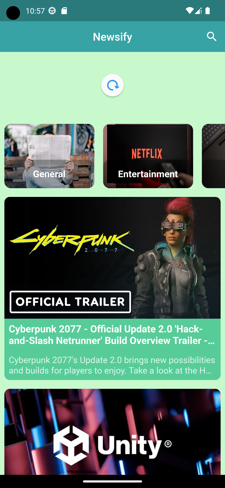
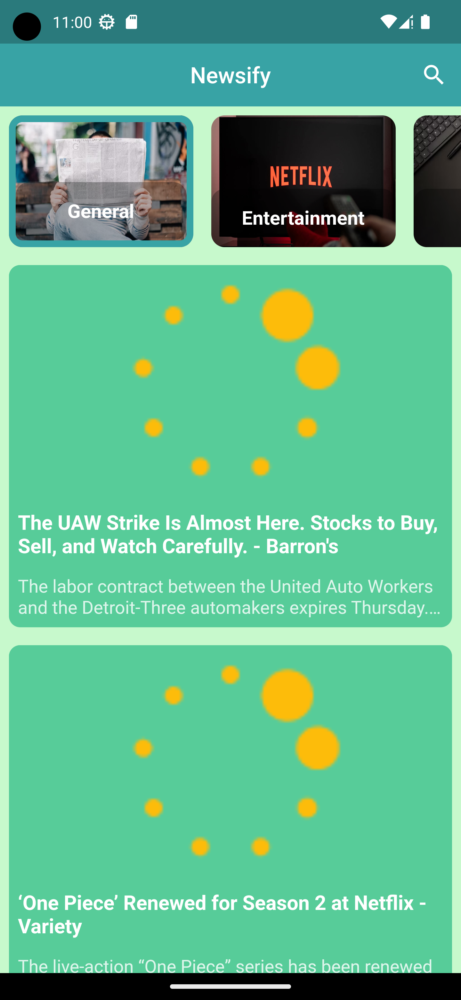

# Newsify - Your Personal News App

<p align="center"></p>

Newsify is a feature-rich news app built with Flutter that allows you to stay updated with the latest news articles from various sources. With Newsify, you can explore news by category or search for articles using keywords. Each article provides essential information, including the title, description, content with the author, and the publication date.

## Features

- Browse news articles by category, including Business, Technology, Health, and more.
- Search for articles by entering keywords to find topics of interest.
- View detailed information for each article, including the title, description, content, author, and publication date.
- Utilizes the "newsapi.org" API for up-to-date news data.
- State management powered by Bloc (Cubit) for efficient and maintainable app development.

## Screenshots

<div align="center">
  
  
  
  
  
  
  
  
  
  
  
</div>

## Installation

1. Clone the repository using the following command:

   ```bash
   git clone https://github.com/Mohamed-code-13/newsify_app_flutter.git
   ```

2. Navigate to the project directory:

   ```bash
   cd newsify_app_flutter
   ```

3. Install dependencies:

   ```bash
   flutter pub get
   ```

4. Get your API key from <a href="https://newsapi.org/" title="News API">newsapi.org</a> and replace `YOUR_API_KEY` with your actual API key in the `lib/data/services/news_service.dart` file.

## State Management with Bloc (Cubit)

This project utilizes the Bloc (Cubit) pattern for state management. Separating the business logic for fetching and managing news articles. Bloc makes it easy to handle complex state changes and asynchronous operations in your app.

## Usage

1. Launch the app on your device using the `flutter run` command.
2. Browse news articles by selecting a category or using the search feature to find articles based on keywords.
3. Tap on an article to view detailed information, including the title, description, content, author, and publication date.

## License

This project is licensed under the MIT License.
